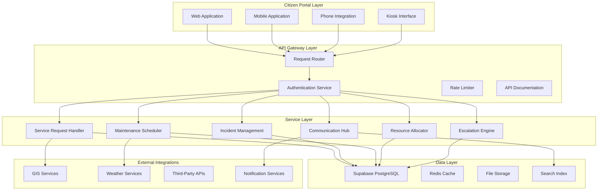
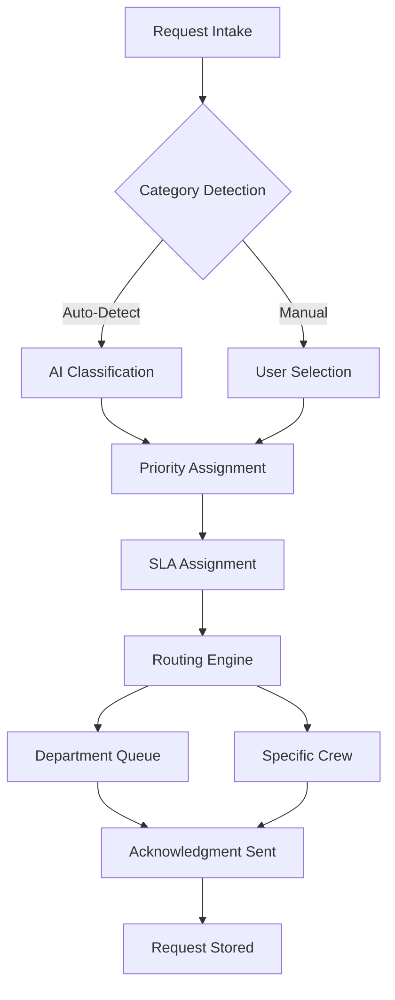
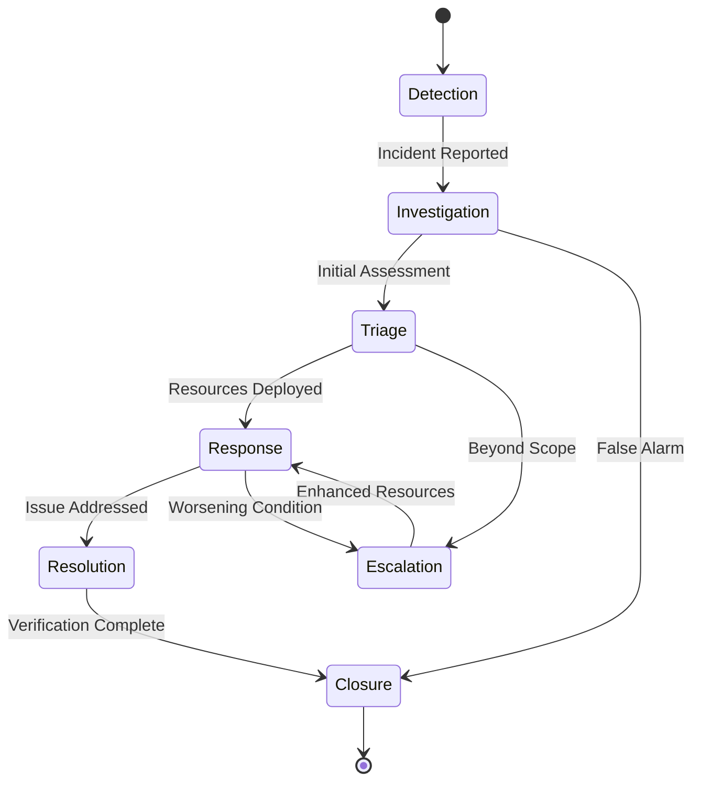
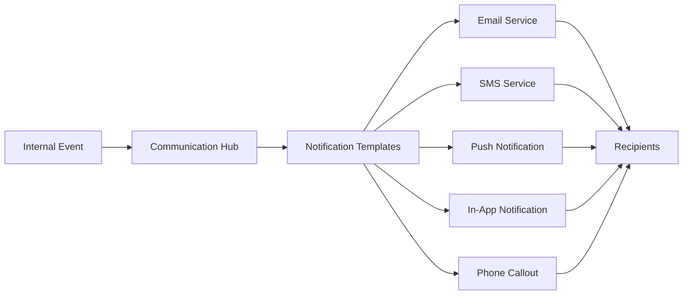
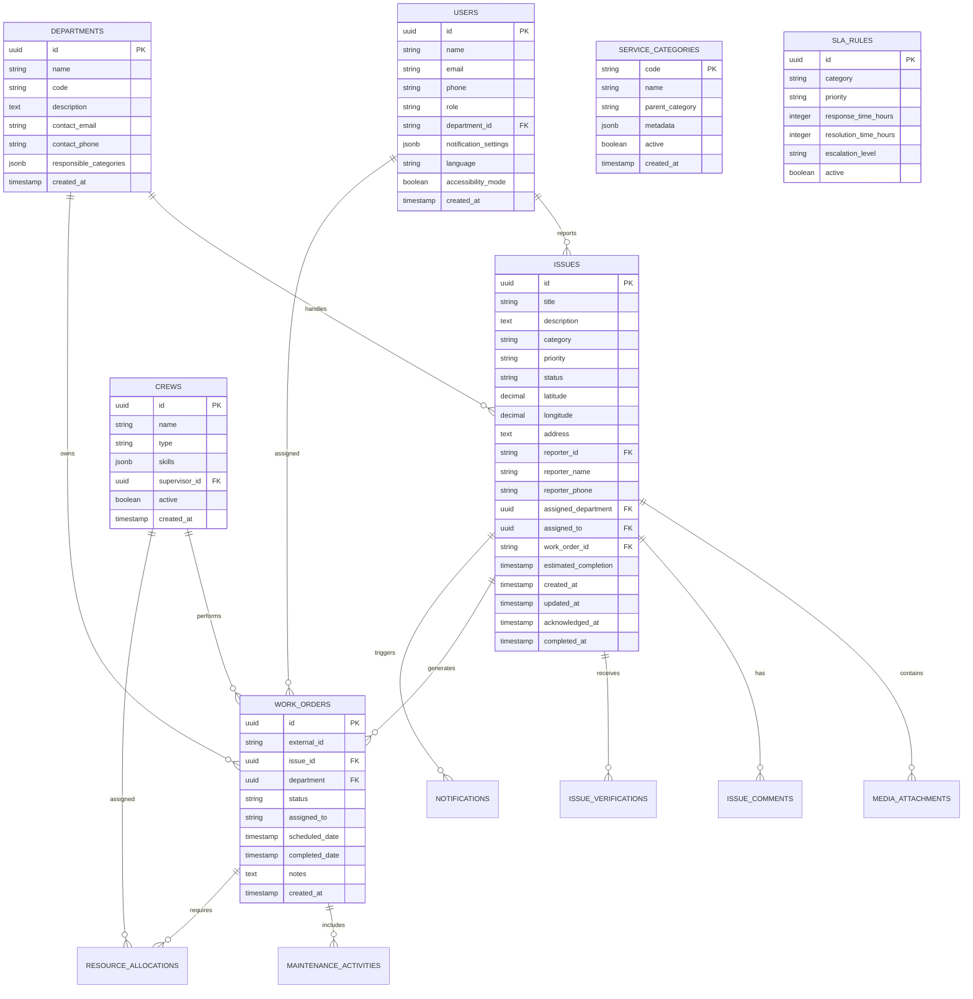
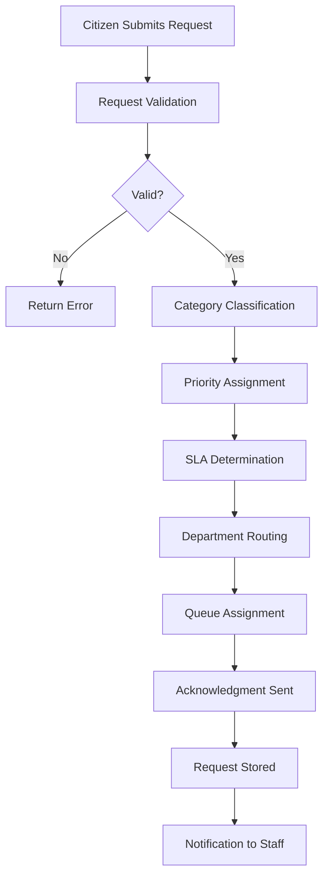
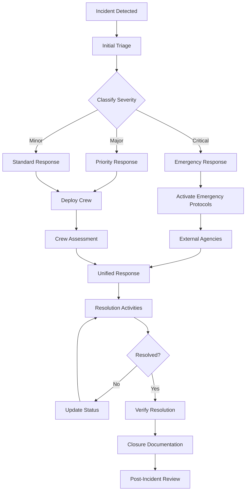
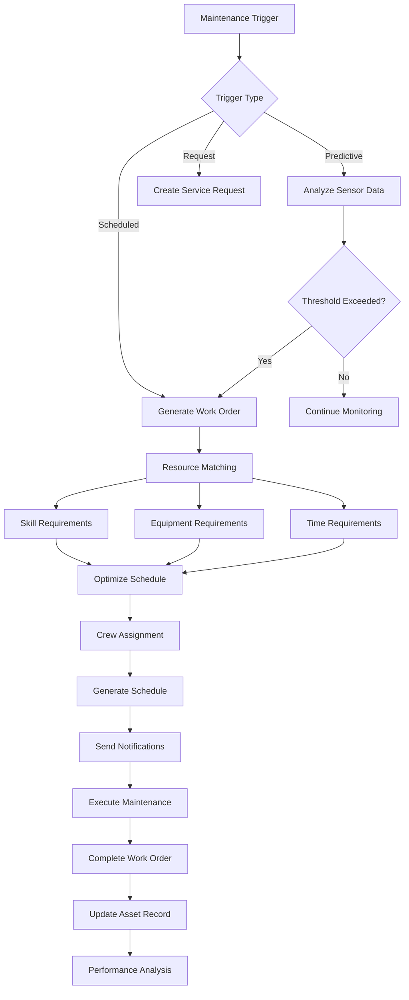
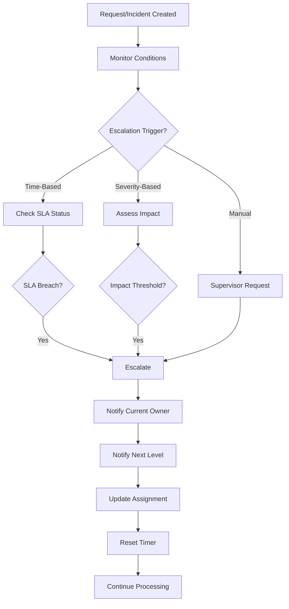

# Support System Architecture Document

**Electri-Map Civic Infrastructure Management Platform**

**Version:** 1.0  
**Date:** January 2025  
**Status:** Architecture Specification

---

## Table of Contents

1. [System Overview](#1-system-overview)
2. [Service Category Taxonomy](#2-service-category-taxonomy)
3. [Core System Components](#3-core-system-components)
4. [Data Model](#4-data-model)
5. [Workflow Diagrams](#5-workflow-diagrams)
6. [Integration Points](#6-integration-points)
7. [Technical Recommendations](#7-technical-recommendations)
8. [Security and Compliance](#8-security-and-compliance)
9. [Scalability Considerations](#9-scalability-considerations)

---

## 1. System Overview

### 1.1 High-Level Architecture

The Support System Architecture is designed as a modular, extensible platform that extends the existing electri-map infrastructure to support comprehensive civic service management. The architecture follows a layered approach with clear separation between citizen-facing services, operational systems, and backend infrastructure.

### 1.2 Architecture Principles

The architecture is built upon several foundational principles that guide all design decisions and implementation choices:

**Modularity and Extensibility** ensures that each system component operates independently with well-defined interfaces, allowing new service categories and features to be added without disrupting existing functionality. This principle supports the platform's evolution as civic needs change and new service categories emerge.

**Scalability** is achieved through horizontal scaling capabilities at each architectural layer. The system can handle increased load by adding resources rather than requiring fundamental architectural changes. This includes database sharding strategies, caching layers, and stateless service design.

**Resilience and Fault Tolerance** ensures continuous operation even when individual components fail. The architecture incorporates redundant paths, circuit breakers, and graceful degradation strategies to maintain service availability.

**Security by Design** embeds security considerations at every layer, from authentication and authorization at the API gateway to data encryption at rest and in transit. Row-level security policies ensure data isolation and access control.

### 1.3 System Boundaries

The platform operates within clearly defined boundaries that separate it from external systems and define its scope of responsibility.

**In-Scope Components** include all service request intake, incident lifecycle management, maintenance scheduling, resource allocation, and stakeholder communication. The system manages the complete lifecycle of civic infrastructure issues from initial detection through resolution.

**Out-of-Scope Components** include direct hardware control systems, emergency responder dispatch, and financial transaction processing. Integration points exist for these systems, but they are not part of the core platform.

---

## 2. Service Category Taxonomy

### 2.1 Service Category Hierarchy

The service taxonomy is organized into a hierarchical structure that allows for both broad categorization and specific issue typing. Each category contains subcategories that provide more granular classification for routing and assignment purposes.

```mermaid
graph TD
    ROOT[Civic Services] --> ELEC[Electrical Systems]
    ROOT --> TELE[Telecommunications]
    ROOT --> ROAD[Road Networks]
    ROOT --> WATR[Water & Sanitation]
    ROOT --> GAS[Gas Distribution]
    ROOT --> BLDG[Public Buildings]
    ROOT --> WAST[Waste Management]
    ROOT --> SAFE[Public Safety]

    ELEC --> ELEC_POW[Power Distribution]
    ELEC --> ELEC_LGT[Public Lighting]
    ELEC --> ELEC_SUB[Substations]

    TELE --> TELE_FIB[Fiber Optics]
    TELE --> TELE_BRO[Broadband]
    TELE --> TELE_CEL[Cellular]

    ROAD --> ROAD_POT[Potholes]
    ROAD --> ROAD_SGN[Signage]
    ROAD --> ROAD_TRA[Traffic Signals]
    ROAD --> ROAD_SDW[Sidewalks]

    WATR --> WATR_SUP[Water Supply]
    WATR --> WATR_SAN[Sanitation]
    WATR --> WATR_STM[Storm Drains]

    GAS --> GAS_PIP[Pipeline]
    GAS --> GAS_MET[Meters]
    GAS --> GAS_LEA[Leak Response]

    BLDG --> BLDG_MUN[Municipal]
    BLDG --> BLDG_REC[Recreation]
    BLDG --> BLDG_EME[Emergency]

    WAST --> WAST_COL[Collection]
    WAST --> WAST_REC[Recycling]
    WAST --> WAST_DIS[Disposal]

    SAFE --> SAFE_CAM[Surveillance]
    SAFE --> SAFE_EME[Emergency Systems]
```

### 2.2 Category Definitions

#### 2.2.1 Electrical Systems and Power Distribution Networks

This category encompasses all electrical infrastructure including power lines, transformers, substations, and public lighting systems. The electrical category is the primary focus of the existing electri-map platform.

**Subcategories:**
- **Power Distribution** covers issues with overhead and underground power lines, transformers, fuse boxes, and electrical panels serving residential and commercial areas
- **Public Lighting** includes street lights, decorative lighting, and pathway illumination in public spaces
- **Substations and Equipment** addresses issues with larger electrical infrastructure including switchgear, capacitors, and control systems

**Examples:**
- Downed power line requiring immediate response
- Street light out in residential area
- Transformer humming or sparking
- Power outage affecting multiple customers
- Vegetation encroaching on power lines

#### 2.2.2 Telecommunications Infrastructure and Connectivity Solutions

This category addresses internet, telephone, and data connectivity infrastructure maintained by service providers or municipal entities.

**Subcategories:**
- **Fiber Optic Networks** covers municipal fiber infrastructure, splice points, and distribution cabinets
- **Broadband Services** addresses cable, DSL, and other wired broadband infrastructure
- **Cellular Infrastructure** includes cell towers, small cells, and related equipment

**Examples:**
- Damaged fiber optic cable causing service outage
- Fallen cable on public property
- Damaged telephone pole
- WiFi hotspot out of service
- 5G small cell equipment damage

#### 2.2.3 Road Networks and Transportation Infrastructure

This category covers all surface transportation infrastructure including roads, bridges, sidewalks, and associated traffic management systems.

**Subcategories:**
- **Pavement Conditions** includes potholes, cracks, deterioration, and surface failures
- **Traffic Signage** covers all road signs including regulatory, warning, and informational signs
- **Traffic Signals** addresses traffic lights, pedestrian signals, and school zone signals
- **Sidewalks and Pathways** includes pedestrian infrastructure and accessibility features

**Examples:**
- Large pothole requiring repair
- Traffic signal malfunction
- Missing or damaged street sign
- Sidewalk trip hazard
- School zone flashing beacon not working
- Bridge structural concerns

#### 2.2.4 Water and Sanitation Systems

This category encompasses municipal water supply, wastewater collection, and storm water management infrastructure.

**Subcategories:**
- **Water Supply** covers water mains, service lines, hydrants, and metering equipment
- **Sanitary Sewer** addresses sewer mains, lift stations, and related collection infrastructure
- **Storm Drainage** includes catch basins, storm sewers, and retention facilities

**Examples:**
- Water main break
- Fire hydrant damaged or flowing
- Sewer backup or overflow
- Storm drain clogging causing flooding
- Water quality concern
- Leaking service connection

#### 2.2.5 Gas Distribution Networks

This category addresses natural gas and propane distribution infrastructure maintained by utility providers.

**Subcategories:**
- **Pipeline Integrity** covers transmission and distribution pipelines
- **Metering Equipment** addresses gas meters and regulators
- **Leak Response** is reserved for suspected gas leaks requiring emergency response

**Examples:**
- Suspected gas leak (emergency priority)
- Damaged gas meter
- Corroded pipeline section
- Missing or damaged pipeline marker
- Vegetation interfering with pipeline

#### 2.2.6 Public Buildings and Facilities

This category covers municipal buildings, recreation facilities, and other public infrastructure.

**Subcategories:**
- **Municipal Buildings** includes city halls, police stations, and administrative facilities
- **Recreation Facilities** covers parks, community centers, and sports facilities
- **Emergency Facilities** addresses fire stations, emergency operations centers, and shelters

**Examples:**
- HVAC system failure in municipal building
- Playground equipment damage
- Building security concern
- Restroom facility out of service
- Accessibility barrier
- Roof leak in public building

#### 2.2.7 Waste Management Services

This category addresses solid waste collection, recycling programs, and disposal facilities.

**Subcategories:**
- **Collection Services** covers missed pickups, container issues, and scheduling
- **Recycling Programs** addresses recycling contamination, education, and special collections
- **Disposal Facilities** includes transfer stations, landfills, and material recovery facilities

**Examples:**
- Missed garbage collection
- Overflowing public trash receptacle
- Illegal dumping
- Recycling bin contamination
- Bulk item pickup request
- Hazardous waste disposal inquiry

#### 2.2.8 Public Safety Infrastructure

This category encompasses systems and equipment that support public safety and emergency response.

**Subcategories:**
- **Surveillance Systems** covers public safety cameras and monitoring infrastructure
- **Emergency Systems** addresses emergency alert systems, sirens, and mass notification
- **Access Control** includes security systems, gates, and barriers at public facilities

**Examples:**
- Public safety camera malfunction
- Emergency siren not functioning
- Security system failure
- Blue light emergency phone out of service
- Traffic calming measure concern

---

## 3. Core System Components

### 3.1 Service Request Handling System

The Service Request Handling System serves as the primary intake mechanism for all service requests from citizens, employees, and automated monitoring systems.

**Multi-Channel Intake:**
The system supports intake through multiple channels including the web application, mobile application, phone integration via IVR system, and in-person kiosks located in public facilities. Each channel normalizes incoming requests into a consistent format for processing.

**Request Categorization:**
Automatic categorization uses machine learning models trained on historical request data to suggest appropriate categories based on title, description, and location. Users can override suggestions, and their corrections improve model accuracy over time.

**Priority Assignment:**
Priority is determined by a combination of factors including:
- User-selected priority level
- Category-specific default priorities
- Location context (school zones, hospitals, high-traffic areas)
- Real-time conditions (weather, ongoing incidents)
- Historical patterns for similar issues

**SLA Assignment:**
Service Level Agreements are assigned based on priority and category combinations. Critical infrastructure issues have faster response time targets than routine maintenance requests. SLAs are tracked and reported against for performance management.

### 3.2 Incident Management System

The Incident Management System handles high-priority incidents that require coordinated response and may involve multiple departments or external agencies.

**Incident Classification:**
Incidents are classified by severity using a four-tier system:
- **Critical** (P1): Immediate threat to life safety, requires emergency response
- **Major** (P2): Significant service disruption affecting many customers
- **Minor** (P3): Localized issue with limited impact
- **Low** (P4): Minor inconvenience, routine response acceptable

**Incident Lifecycle:**
Each incident progresses through defined lifecycle stages that trigger notifications and enable tracking. The system maintains complete audit trails of all actions taken during incident response.

**Root Cause Analysis:**
For incidents meeting certain thresholds, the system initiates root cause analysis workflows that document contributing factors, identify systemic issues, and recommend preventive measures.

### 3.3 Maintenance Scheduling System

The Maintenance Scheduling System manages preventive and predictive maintenance activities across all service categories.

**Preventive Maintenance:**
Scheduled maintenance follows established intervals for equipment and infrastructure. The system generates work orders automatically based on maintenance schedules and tracks completion rates.

**Predictive Maintenance:**
Integration with IoT sensors and monitoring systems enables predictive maintenance triggers. The system analyzes sensor data to identify equipment degradation patterns and generates work orders before failures occur.

**Work Order Generation:**
Work orders are generated from multiple sources:
- Scheduled preventive maintenance
- Predictive maintenance alerts
- Service requests requiring field response
- Incidents requiring follow-up work
- Management-directed maintenance activities

**Resource Skill Matching:**
The scheduling system matches work orders to available crews based on:
- Required skills and certifications
- Geographic location and route efficiency
- Equipment and material requirements
- Crew availability and workload
- Time constraints and SLA deadlines

### 3.4 Resource Allocation Module

The Resource Allocation Module optimizes the deployment of personnel, equipment, and materials across service requests and maintenance activities.

**Crew Assignment:**
Crews are assigned to work orders based on complex optimization algorithms that consider:
- Geographic proximity to work locations
- Current workload and availability
- Required skills and certifications
- Equipment and vehicle requirements
- Travel time and overtime costs

**Equipment Tracking:**
The system tracks equipment and vehicle locations, availability, and maintenance status. Integration with GPS systems enables real-time tracking and improved dispatching.

**Material Management:**
Inventory levels for commonly used materials are monitored, and the system can generate purchase orders when supplies fall below reorder points. For specialized materials, work orders include material requirements for procurement.

### 3.5 Communication Protocols

The Communication Hub manages all stakeholder communications including internal notifications and customer updates.

**Internal Notifications:**
Staff receive notifications based on role and assignment. Notification triggers include:
- New requests assigned to their queue
- SLA deadline approaching
- Escalation requirements
- Status changes on tracked items
- Communication from citizens

**Customer Updates:**
Citizens receive updates through their preferred channels:
- Email notifications for status changes
- SMS alerts for critical issues
- Push notifications for mobile app users
- In-app notifications for tracked requests
- Automated phone calls for emergency situations

**Multi-Language Support:**
All communications support multiple languages with:
- Language preference detection
- Template translations
- RTL text support
- Accessibility-compliant formats

### 3.6 Escalation Procedures

The Escalation Engine automatically manages escalation pathways based on configurable rules.

**Automatic Escalation Triggers:**
- Time-based: No response within SLA timeframe
- Severity-based: Critical incidents escalate immediately
- Impact-based: Issues affecting many customers escalate
- Request-based: Citizen requests for escalation

**Escalation Chains:**
Each service category has defined escalation chains:
- Level 1: Frontline staff
- Level 2: Shift supervisor
- Level 3: Department manager
- Level 4: Director-level
- Level 5: Executive emergency response

**Emergency Protocols:**
Critical incidents follow emergency protocols that:
- Activate emergency response teams
- Engage external agencies as needed
- Implement communication cascades
- Activate backup systems and procedures

---

## 4. Data Model

### 4.1 Core Entities

The data model extends the existing Supabase schema with new tables and relationships to support the expanded functionality.

### 4.2 Extended Entities

**Maintenance Activities Table:**
Tracks individual maintenance tasks within work orders.

| Column | Type | Description |
|--------|------|-------------|
| id | UUID | Primary key |
| work_order_id | UUID | FK to work_orders |
| activity_type | VARCHAR | Type of maintenance |
| description | TEXT | Activity details |
| scheduled_date | TIMESTAMP | Planned date |
| completed_date | TIMESTAMP | Actual completion |
| status | VARCHAR | Current status |
| notes | TEXT | Work notes |

**Resource Allocations Table:**
Tracks resource assignments to work orders.

| Column | Type | Description |
|--------|------|-------------|
| id | UUID | Primary key |
| work_order_id | UUID | FK to work_orders |
| resource_type | VARCHAR | crew, equipment, material |
| resource_id | UUID | FK to specific resource |
| quantity | INTEGER | Amount allocated |
| start_time | TIMESTAMP | Allocation start |
| end_time | TIMESTAMP | Allocation end |

**Escalation Rules Table:**
Defines automatic escalation triggers.

| Column | Type | Description |
|--------|------|-------------|
| id | UUID | Primary key |
| category | VARCHAR | Service category |
| priority | VARCHAR | Priority level |
| trigger_type | VARCHAR | time, severity, impact |
| trigger_value | INTEGER | Threshold value |
| escalate_to | UUID | FK to user/department |
| notify_original | BOOLEAN | Notify original assignee |
| active | BOOLEAN | Rule status |

### 4.3 Relationships and Constraints

**Foreign Key Relationships:**
- Issues reference Users for reporter and assignee
- Issues reference Departments for assignment
- Work Orders reference Issues for linkage
- Work Orders reference Departments for ownership
- Media Attachments reference Issues for ownership
- Comments reference Issues and Users

**Index Strategy:**
- Composite indexes for common query patterns
- GIN indexes for JSONB columns
- Spatial indexes for location-based queries
- Partial indexes for status-based filtering

---

## 5. Workflow Diagrams

### 5.1 Service Request Workflow

### 5.2 Incident Response Workflow

### 5.3 Maintenance Scheduling Workflow

### 5.4 Escalation Workflow

---

## 6. Integration Points

### 6.1 Existing Electri-Map Integration

The support system builds upon and extends existing electri-map components:

**Existing Components Integration:**
- [`components/civic/issue-report-form.tsx`](components/civic/issue-report-form.tsx:1) extends to support new categories
- [`components/civic/category-selector.tsx`](components/civic/category-selector.tsx:1) adds new service categories
- [`app/api/issues/route.ts`](app/api/issues/route.ts:1) enhanced with new filtering options
- [`types/civic-issue.ts`](types/civic-issue.ts:1) extended with new types and interfaces
- [`supabase/schema.sql`](supabase/schema.sql:1) enhanced with new tables and functions

**Data Sharing:**
The platform shares data with existing electri-map components:
- Issue data flows bidirectionally with the existing civic issue system
- Location data integrates with the existing map infrastructure
- User authentication uses existing Supabase auth integration
- Media storage leverages existing Supabase Storage buckets

### 6.2 External System Integrations

**GIS Integration:**
The system integrates with Geographic Information Systems for:
- Advanced location analysis
- Asset mapping and management
- Service area boundaries
- Spatial querying and reporting

**Weather Services:**
Weather data integration enables:
- Weather-responsive priority adjustment
- Seasonal maintenance scheduling
- Emergency preparedness coordination
- Impact prediction modeling

**Notification Services:**
Multi-channel notification delivery through:
- Email service (SendGrid, Postmark)
- SMS service (Twilio, AWS SNS)
- Push notification service (Firebase, OneSignal)
- Voice call service (Twilio)

**IoT and Sensor Platforms:**
Integration with monitoring systems for:
- Real-time equipment status
- Predictive maintenance triggers
- Anomaly detection alerts
- Asset health monitoring

### 6.3 API Architecture

The system exposes a comprehensive API for integration with external systems.

**REST API Endpoints:**

| Endpoint | Methods | Description |
|----------|---------|-------------|
| `/api/requests` | GET, POST | Service request management |
| `/api/incidents` | GET, POST, PUT | Incident lifecycle |
| `/api/work-orders` | GET, POST, PUT | Work order management |
| `/api/maintenance` | GET, POST | Maintenance scheduling |
| `/api/resources` | GET, PUT | Resource allocation |
| `/api/communications` | POST | Notification delivery |
| `/api/escalations` | GET, POST | Escalation management |
| `/api/reports` | GET | Analytics and reporting |

**WebSocket Connections:**
Real-time updates through WebSocket connections for:
- Live status updates
- Real-time dashboards
- Crew location tracking
- Emergency alerts

---

## 7. Technical Recommendations

### 7.1 Technology Stack

Based on the existing electri-map infrastructure and the requirements of the support system, the following technology recommendations are made:

**Frontend Technologies:**
- React 18 with TypeScript for type safety
- Next.js 14 for server-side rendering and API routes
- Tailwind CSS with shadcn/ui component library
- React Query for server state management
- Zod for runtime validation

**Backend Technologies:**
- Node.js runtime on Vercel or similar platform
- Supabase for database and authentication
- Redis for caching and real-time features
- Cloudflare Workers for edge functions

**Infrastructure:**
- Vercel for application hosting
- Supabase for managed PostgreSQL
- Cloudflare CDN for asset delivery
- AWS S3 or Supabase Storage for file storage

### 7.2 Scalability Recommendations

**Database Scaling:**
- Implement read replicas for query-heavy workloads
- Consider database sharding by geographic region for very large deployments
- Use connection pooling to manage database connections
- Implement archiving strategy for historical data

**Application Scaling:**
- Design stateless services for horizontal scaling
- Implement caching strategy with Redis for frequently accessed data
- Use CDN for static assets and API responses
- Consider microservices architecture for very large deployments

**Real-Time Features:**
- Use Supabase Realtime for WebSocket connections
- Implement message queues for background processing
- Consider serverless functions for event-driven workloads

### 7.3 Performance Optimization

**Query Optimization:**
- Implement database indexes for all common query patterns
- Use pagination for list endpoints
- Implement field selection to reduce data transfer
- Cache expensive queries with Redis

**Frontend Performance:**
- Implement code splitting and lazy loading
- Use React Server Components where possible
- Optimize images and media files
- Implement aggressive caching strategies

**API Performance:**
- Implement rate limiting to prevent abuse
- Use compression for API responses
- Batch operations where possible
- Implement request debouncing for search

### 7.4 Monitoring and Observability

**Metrics to Track:**
- Request latency and throughput
- Error rates and types
- SLA compliance percentages
- Queue depths and processing times
- Resource utilization

**Logging Strategy:**
- Structured logging with correlation IDs
- Log levels appropriately (debug, info, warn, error)
- Centralized log aggregation
- Retention policies for compliance

**Alerting:**
- SLA breach alerts
- Error rate thresholds
- System resource utilization
- Queue backlog warnings

---

## 8. Security and Compliance

### 8.1 Authentication and Authorization

**Authentication Methods:**
- Email/password authentication
- Social login (Google, Apple)
- Phone number authentication
- Integration with municipal SSO systems

**Authorization Model:**
- Role-based access control (RBAC)
- Attribute-based access for sensitive data
- Row-level security in database
- Department-based data isolation

### 8.2 Data Protection

**Encryption:**
- TLS 1.3 for data in transit
- AES-256 encryption for data at rest
- Encryption of sensitive fields (PII)
- Key rotation policies

**Data Classification:**
- Public data: Issue reports, status updates
- Internal data: Staff information, operations
- Confidential: Citizen PII, incident details
- Restricted: Security data, audit logs

### 8.3 Compliance Requirements

**Accessibility:**
- WCAG 2.1 AA compliance
- Section 508 compliance
- Keyboard navigation support
- Screen reader compatibility

**Privacy:**
- GDPR compliance for data handling
- CCPA compliance for California residents
- Data retention policies
- Right to deletion processes

**Audit Requirements:**
- Complete audit trail of all actions
- Immutable logs for compliance
- Regular access reviews
- Penetration testing schedule

---

## 9. Scalability Considerations

### 9.1 Growth Projections

The architecture is designed to support growth from initial deployment through enterprise-scale operations:

**Phase 1: Initial Deployment**
- Supports up to 100,000 citizens
- Handles 1,000 requests per day
- 10 concurrent staff users
- Single geographic region

**Phase 2: Regional Scale**
- Supports up to 1,000,000 citizens
- Handles 10,000 requests per day
- 100 concurrent staff users
- Multiple geographic regions

**Phase 3: Enterprise Scale**
- Supports 10,000,000+ citizens
- Handles 100,000+ requests per day
- 1,000+ concurrent staff users
- Multi-national deployment

### 9.2 Scaling Strategies

**Horizontal Scaling:**
- Stateless application servers
- Load balanced across instances
- Auto-scaling based on demand
- Distributed caching

**Vertical Scaling:**
- Database instance sizing
- Memory optimization
- Storage capacity planning
- Network bandwidth

**Geographic Scaling:**
- Multi-region deployment
- CDN for static content
- Database read replicas per region
- Localized content delivery

### 9.3 Cost Optimization

**Resource Optimization:**
- Right-sizing infrastructure
- Scheduled scaling for predictable load
- Spot instances for batch processing
- Storage tiering

**Operational Efficiency:**
- Automated provisioning
- Infrastructure as code
- Monitoring-driven optimization
- Energy-efficient operations

---

## Appendix A: Glossary

| Term | Definition |
|------|------------|
| SLA | Service Level Agreement - defined response and resolution time targets |
| Work Order | Formal authorization for maintenance or repair work |
| Incident | High-priority event requiring coordinated response |
| Request | Citizen-submitted service request or issue report |
| Escalation | Promotion of issue to higher authority or resource level |
| RLS | Row Level Security - database-level access control |
| IoT | Internet of Things - networked sensors and devices |

---

## Appendix B: Reference Documents

- Existing Electri-Map Documentation
- Supabase Documentation
- Next.js Documentation
- React Documentation
- PostgreSQL Documentation

---

**Document Version History**

| Version | Date | Author | Changes |
|---------|------|--------|---------|
| 1.0 | January 2025 | Architecture Team | Initial release |

---

*This architecture document provides the foundation for implementation. All technical decisions should align with these principles while allowing flexibility for implementation-specific optimizations.*
