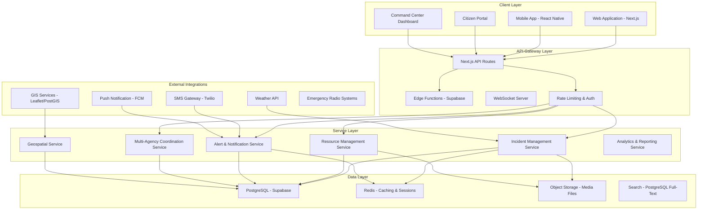
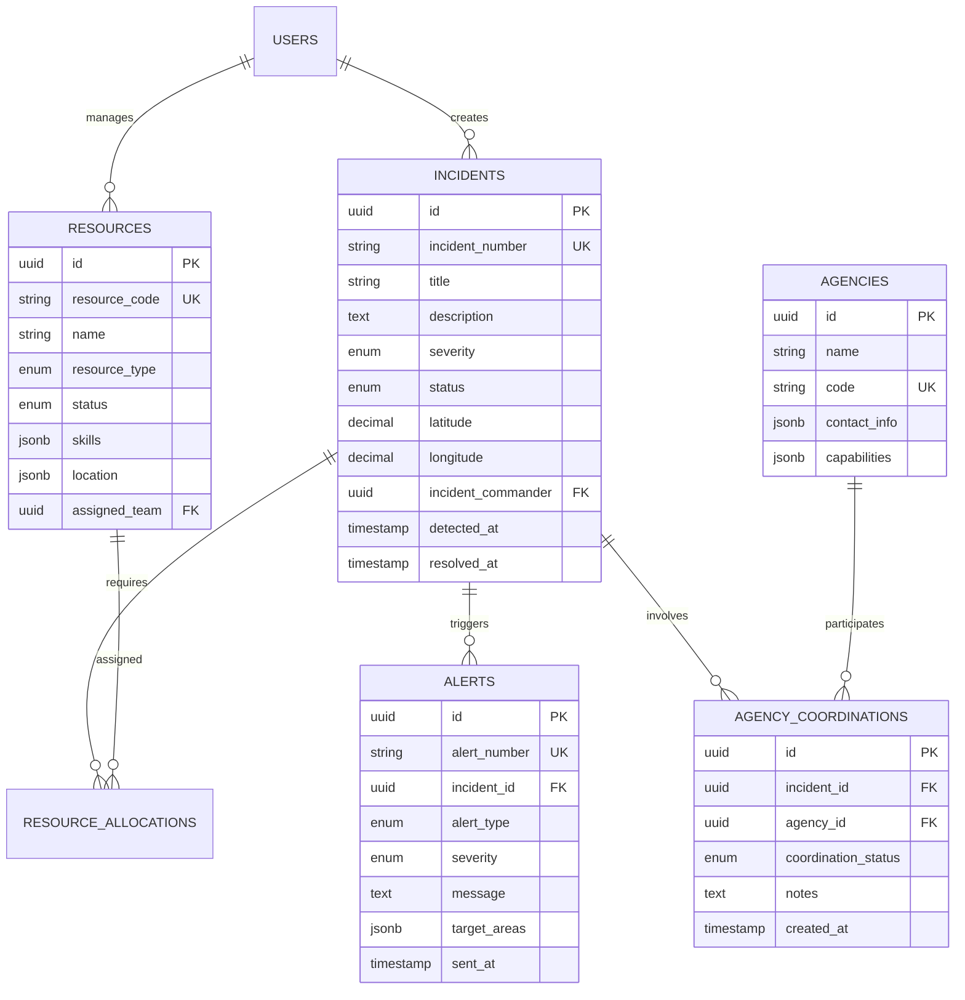
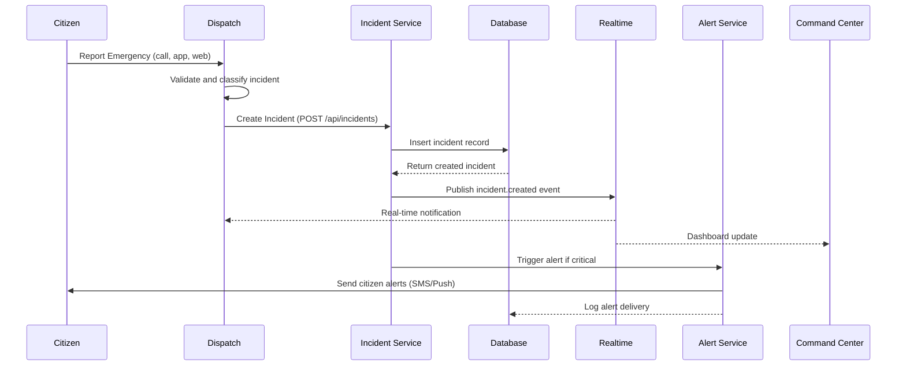
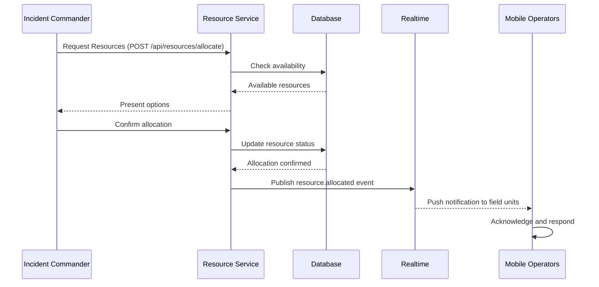

# Emergency Response Application - Full Stack Architecture & Tech Stack Plan

**Document Version:** 1.0  
**Date:** February 2026  
**Status:** Architecture Planning Phase  
**Author:** Kilo Code - Architect Mode

---

## 1. Executive Summary

This document outlines the comprehensive full-stack architecture and technology stack for building an **Emergency Response Application** that integrates with the existing neighborpulse civic infrastructure monitoring platform. The application will support emergency services (bombeiros, protecao civil) with real-time incident management, multi-agency coordination, resource tracking, and citizen alert systems.

**Key Objectives:**
- Real-time emergency incident tracking and management
- Multi-agency coordination for fire services, civil protection, EMS, and police
- Resource allocation and tracking (personnel, equipment, vehicles)
- Citizen alert and notification system
- Integration with existing NeighborPulse infrastructure
- Scalable architecture supporting 1M+ concurrent users during emergencies

---

## 2. System Architecture Overview

### 2.1 High-Level Architecture Diagram



### 2.2 Core Architecture Principles

1. **Microservices-ready Monolith:** Start with modular monolith architecture that can be decomposed into microservices as the platform scales
2. **Event-Driven Architecture:** Use Supabase Realtime for real-time updates across all clients
3. **Geo-Distributed Data:** Leverage Supabase's multi-region capabilities for low-latency access
4. **Offline-First Mobile:** React Native with offline-first data synchronization
5. **Graceful Degradation:** All features work with reduced functionality during high load or connectivity issues

---

## 3. Technology Stack Selection

### 3.1 Frontend Technologies

| Layer | Technology | Version | Justification |
|-------|------------|---------|---------------|
| **Web Framework** | Next.js | 16 | Current project standard, App Router, Server Components |
| **UI Library** | React | 19 | Latest React with Concurrent Features |
| **UI Components** | Radix UI + Tailwind | Latest | Accessibility-first, composable, current stack |
| **State Management** | Zustand | Latest | Simple, performant, works with SSR |
| **Maps** | React-Leaflet + Leaflet | Latest | Open-source, works offline, current stack |
| **Charts** | Recharts | Latest | Declarative, responsive charts |
| **Forms** | React Hook Form + Zod | Latest | Performance, validation |
| **Animations** | Framer Motion | Latest | Smooth, production-ready animations |
| **Mobile Framework** | React Native | 0.76+ | Cross-platform, code sharing with web |
| **Mobile Navigation** | React Navigation | 6+ | Native navigation patterns |

### 3.2 Backend Technologies

| Layer | Technology | Version | Justification |
|-------|------------|---------|---------------|
| **Runtime** | Node.js | 22 LTS | Current LTS, works with Next.js |
| **API Layer** | Next.js API Routes | Built-in | Current stack, serverless deployment |
| **Database** | PostgreSQL | 16 | Supabase standard, PostGIS for geospatial |
| **ORM** | Prisma | 6 | Type-safe, migration management |
| **Authentication** | Supabase Auth | Built-in | Current stack, RLS policies |
| **Real-time** | Supabase Realtime | Built-in | WebSocket subscriptions |
| **Caching** | Redis | 7 | Session storage, hot data caching |
| **Search** | PostgreSQL Full-Text | Built-in | Full-text search without external dependency |

### 3.3 Infrastructure & DevOps

| Layer | Technology | Justification |
|-------|------------|---------------|
| **Hosting** | Vercel | Native Next.js support, edge functions |
| **Database** | Supabase | Current stack, PostgreSQL + Realtime |
| **CDN** | Vercel Edge Network | Global distribution, low latency |
| **CI/CD** | GitHub Actions | Native integration, current stack |
| **Monitoring** | Sentry + Vercel Analytics | Error tracking, performance monitoring |
| **Logging** | Supabase Logs + CloudWatch | Centralized logging |
| **Secrets** | Vercel Environment Variables | Secure secret management |

### 3.4 External Services & APIs

| Service | Purpose | Cost Tier |
|---------|---------|-----------|
| **Twilio** | SMS Alerts | Pay-per-use |
| **Firebase Cloud Messaging** | Push Notifications | Free tier available |
| **OpenWeatherMap** | Weather Data | Free tier available |
| **Nominatim/OSM** | Geocoding | Free (OpenStreetMap) |
| **Twilio Verify** | Phone Verification | Pay-per-use |

---

## 4. Application Architecture

### 4.1 Module Structure

```
neighborpulse/
├── app/                           # Next.js App Router
│   ├── (auth)/                    # Authentication routes
│   │   ├── login/
│   │   ├── register/
│   │   └── forgot-password/
│   ├── (dashboard)/               # Protected dashboard routes
│   │   ├── command-center/        # Emergency command center
│   │   │   ├── dashboard/
│   │   │   ├── incidents/
│   │   │   ├── resources/
│   │   │   └── alerts/
│   │   ├── incidents/            # Incident management
│   │   │   ├── [id]/
│   │   │   ├── create/
│   │   │   └── list/
│   │   ├── resources/            # Resource management
│   │   │   ├── personnel/
│   │   │   ├── equipment/
│   │   │   └── vehicles/
│   │   ├── coordination/         # Multi-agency coordination
│   │   │   ├── agencies/
│   │   │   ├── communications/
│   │   │   └── protocols/
│   │   └── analytics/            # Reports and analytics
│   ├── (public)/                  # Public routes
│   │   ├── citizen-alerts/
│   │   ├── safe-zones/
│   │   └── report-incident/
│   └── api/                       # API routes
│       ├── incidents/
│       ├── resources/
│       ├── alerts/
│       └── coordinates/
├── components/
│   ├── emergency/                 # Emergency-specific components
│   │   ├── incident-map/
│   │   ├── resource-tracker/
│   │   ├── alert-banner/
│   │   ├── command-dashboard/
│   │   ├── agency-coordination/
│   │   └── real-time-feed/
│   ├── maps/                      # Map components (existing)
│   ├── ui/                         # UI components (existing)
│   └── civic/                      # Civic components (existing)
├── lib/
│   ├── services/                   # Business logic
│   │   ├── incident-service.ts
│   │   ├── resource-service.ts
│   │   ├── alert-service.ts
│   │   ├── coordination-service.ts
│   │   └── geospatial-service.ts
│   ├── hooks/                      # Custom hooks
│   │   ├── use-incidents.ts
│   │   ├── use-resources.ts
│   │   ├── use-alerts.ts
│   │   └── use-realtime.ts
│   ├── stores/                     # Zustand stores
│   │   ├── incident-store.ts
│   │   ├── resource-store.ts
│   │   ├── alert-store.ts
│   │   └── map-store.ts
│   ├── utils/                      # Utilities
│   └── supabase/                   # Supabase client (existing)
├── types/                          # TypeScript types
│   ├── emergency/
│   │   ├── incident.ts
│   │   ├── resource.ts
│   │   ├── alert.ts
│   │   └── coordination.ts
│   └── index.ts
├── supabase/                       # Database & migrations
│   ├── schema.sql
│   ├── functions/                  # Edge functions
│   └── migrations/
└── public/                         # Static assets
```

### 4.2 Database Schema Extensions



---

## 5. Key Feature Modules

### 5.1 Emergency Incident Management

**Features:**
- Create, update, and track emergency incidents
- Severity classification (critical, major, minor, low)
- Status workflow (detected → investigating → responding → resolved → closed)
- Location tracking with interactive map
- Incident timeline and history
- Photo/video attachments
- Related service request linking

**Technical Implementation:**
```
- Database: incidents table with PostGIS spatial queries
- Real-time: Supabase subscriptions for status updates
- Maps: React-Leaflet with custom incident markers
- Search: PostgreSQL full-text on title/description
- Validation: Zod schemas for incident creation
```

### 5.2 Multi-Agency Coordination

**Features:**
- Agency registry with capabilities and contact info
- Real-time coordination status per incident
- Communication logs between agencies
- Shared resource pool management
- Joint command structure support
- Protocol templates (ICS - Incident Command System)
- Interoperability matrix

**Technical Implementation:**
```
- Database: agencies, agency_coordinations tables
- Real-time: WebSocket channels per incident
- Auth: Role-based access (incident commander, agency lead, etc.)
- API: REST endpoints for coordination actions
```

### 5.3 Resource Management

**Features:**
- Personnel tracking (skills, certifications, availability)
- Equipment inventory (type, status, location)
- Vehicle tracking (GPS, availability, assignments)
- Resource allocation to incidents
- Capacity planning and forecasting
- Maintenance scheduling
- Cost tracking and reporting

**Technical Implementation:**
```
- Database: resources, resource_allocations tables
- Real-time: GPS location updates via mobile app
- Search: Filter by type, status, skills, location
- Maps: React-Leaflet with real-time resource positions
- Offline: Local SQLite storage for field units
```

### 5.4 Alert & Notification System

**Features:**
- Multi-channel alerts (SMS, push, email, in-app)
- Geofenced alert targeting
- Alert templates and automation rules
- Delivery tracking and confirmation
- Citizen opt-in preferences
- Multi-language support
- Alert escalation

**Technical Implementation:**
```
- API: Twilio for SMS, FCM for push notifications
- Queue: Redis for rate limiting and delivery
- Templates: Pre-written alert templates by incident type
- Geospatial: PostGIS for radius/area queries
- Languages: next-intl integration
```

### 5.5 Citizen Safe Zone Locator

**Features:**
- Find nearest safe zones with working services
- Filter by: power, water, road access, shelter
- Navigation directions
- Real-time status updates
- Multi-language support
- Offline mode support

**Technical Implementation:**
```
- Database: safe_zones table with service availability
- Maps: React-Leaflet with safe zone markers
- Search: Nearest neighbor queries with PostGIS
- Offline: Cached map tiles and safe zone data
- Navigation: External map app integration
```

### 5.6 Command Center Dashboard

**Features:**
- Real-time incident overview
- Resource allocation visualization
- Alert status board
- Map-based situational awareness
- Agency coordination status
- Key metrics and KPIs
- Incident timeline

**Technical Implementation:**
```
- Real-time: Supabase subscriptions with debouncing
- Charts: Recharts for metrics visualization
- Maps: React-Leaflet with cluster markers
- Layout: Resizable panels for customization
- Theme: Dark mode optimized for operations
```

---

## 6. Data Flow & Integration

### 6.1 Incident Creation Flow



### 6.2 Resource Allocation Flow



### 6.3 Integration with Existing NeighborPulse

The emergency response app integrates with existing NeighborPulse infrastructure:

1. **Shared Authentication:** Supabase Auth (same users, roles)
2. **Shared Database:** Extended schema with RLS policies
3. **Shared Maps:** React-Leaflet components with custom markers
4. **Shared i18n:** next-intl for translations (EN, PT, ES, FR)
5. **Shared UI:** Radix UI + Tailwind design system
6. **Service Categories:** Extended with emergency-specific categories
7. **Notification System:** Enhanced for emergency alerts

---

## 7. Security & Compliance

### 7.1 Security Measures

| Area | Implementation |
|------|----------------|
| **Authentication** | Supabase Auth with MFA for command center |
| **Authorization** | Row-Level Security (RLS) policies |
| **API Security** | Rate limiting, JWT validation, CORS |
| **Data Encryption** | TLS in transit, AES-256 at rest |
| **Secrets** | Vercel Environment Variables |
| **Audit Logging** | Database audit_logs table |
| **Input Validation** | Zod schemas for all inputs |
| **XSS Protection** | React automatic escaping |
| **CSRF Protection** | Next.js built-in |

### 7.2 Compliance Considerations

- **GDPR/CCPA:** Data minimization, right to deletion, consent management
- **Accessibility:** WCAG 2.1 AA compliance
- **Emergency Access:** Exception handling for critical situations
- **Data Retention:** Configurable retention policies for incidents
- **Backup & Recovery:** Supabase daily backups with point-in-time recovery

---

## 8. Performance & Scalability

### 8.1 Performance Targets

| Metric | Target | Measurement |
|--------|--------|-------------|
| Page Load | < 2 seconds | Core Web Vitals |
| Map Rendering | < 1 second | LCP |
| API Response | < 200ms p95 | API latency |
| Real-time Updates | < 500ms | End-to-end latency |
| Alert Delivery | < 30 seconds | Critical alerts |
| Concurrent Users | 100,000+ | Emergency scenarios |

### 8.2 Scalability Strategy

**Layer-by-Layer Scaling:**

1. **CDN/Edge:** Vercel edge network for static assets
2. **API:** Serverless functions auto-scale
3. **Database:** Supabase connection pooling, read replicas
4. **Caching:** Redis for hot data, CDN for static
5. **Real-time:** Supabase WebSocket infrastructure

**Emergency Mode:**
- Pre-warmed containers for peak traffic
- Circuit breakers for external services
- Graceful degradation (disable non-critical features)
- Horizontal scaling of API functions

---

## 9. Development Phases

### Phase 1: Core Infrastructure (Weeks 1-4)
- [ ] Database schema extensions
- [ ] Incident management CRUD
- [ ] Basic authentication/authorization
- [ ] React-Leaflet map integration
- [ ] Real-time subscriptions

### Phase 2: Resource Management (Weeks 5-8)
- [ ] Resource tracking system
- [ ] Allocation workflows
- [ ] Mobile app foundation
- [ ] Offline-first data sync
- [ ] GPS location tracking

### Phase 3: Multi-Agency Coordination (Weeks 9-12)
- [ ] Agency registry
- [ ] Coordination protocols
- [ ] Communication logging
- [ ] Shared resource pools
- [ ] Command structure support

### Phase 4: Alert System (Weeks 13-16)
- [ ] Multi-channel alerts (SMS/Push)
- [ ] Geofenced targeting
- [ ] Template management
- [ ] Delivery tracking
- [ ] Citizen opt-in portal

### Phase 5: Citizen Features (Weeks 17-20)
- [ ] Safe zone locator
- [ ] Incident reporting
- [ ] Alert subscriptions
- [ ] Multi-language support
- [ ] Offline mode

### Phase 6: Command Center (Weeks 21-24)
- [ ] Dashboard analytics
- [ ] Real-time monitoring
- [ ] Reporting system
- [ ] Performance optimization
- [ ] Load testing

---

## 10. Risk Assessment & Mitigation

| Risk | Probability | Impact | Mitigation |
|------|-------------|--------|------------|
| Performance under emergency load | Medium | Critical | Pre-warming, CDN, auto-scaling |
| Data consistency issues | Low | High | Transactional integrity, event sourcing |
| Third-party service outage | Medium | High | Multi-provider fallback, caching |
| Security breach | Low | Critical | RLS, encryption, audit logging |
| User adoption resistance | Medium | Medium | Training, UX optimization |
| Integration complexity | High | Medium | Phased rollout, thorough testing |

---

## 11. Success Metrics

| Metric | Target | Measurement |
|--------|--------|-------------|
| Incident Response Time | < 5 minutes | Create to first responder dispatch |
| Alert Delivery Rate | > 95% | Delivered alerts / total alerts |
| Resource Utilization | > 80% | Allocated resources / total available |
| User Satisfaction | > 4.5/5 | Post-incident surveys |
| System Uptime | > 99.9% | Monitoring uptime checks |
| Emergency Load Capacity | 100,000+ concurrent | Load testing |

---

## 12. Next Steps

1. **Review and Approval:** Stakeholder review of architecture document
2. **Database Migration:** Create Supabase migration for schema extensions
3. **API Development:** Implement core API endpoints
4. **Frontend Development:** Build command center dashboard
5. **Mobile App:** Develop React Native companion app
6. **Testing:** Integration testing with emergency scenarios
7. **Training:** User training for command center staff
8. **Go-Live:** Phased rollout starting with pilot agencies

---

**Document Version:** 1.0  
**Created:** February 2026  
**Status:** Ready for Review
